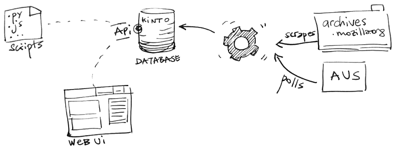

# Buildhub

This *experimental* project aims to provide a public database of comprehensive information about
releases and builds.

This repository has two main folders:

* [ui/](https://github.com/mozilla-services/buildhub/tree/master/ui#readme): A Web UI to browse the available data
* [jobs/](https://github.com/mozilla-services/buildhub/tree/master/jobs#readme): Python tools in charge of aggregating and keeping the data up-to-date.

Currently we use [Kinto](http://kinto-storage.org) as a generic database service. It allows us to leverage its simple API for storing and querying records. It also comes with a set of client libraries for JavaScript, Python etc.

> More specific solutions may replace it when the product scope evolves.

* [Automatic Update Service (AUS, a.k.a Balrog)](https://wiki.mozilla.org/Balrog)

## Data & Schema

Beyond the Kinto API itself, the schema is the main contract between the UI and the importing jobs.

* `source` [object]: about the release sources
  * `product` [string]: Product name
  * `repository` *(optional)* [string]: Full repository URL
  * `tree` *(optional)* [string]: Mercurial tree (e.g. mozilla-central)
  * `revision` *(optional)* [string]: Mercurial changeset
* `build` *(optional)* [object]: about the build process
  * `id` [string]: Build identificator (eg. 20170413214900)
  * `date` [date-time]: Build date (e.g. 2017-04-13T21:49:00Z)
* `target` [object]: about the release target
  * `platform` [string]: Operating system and architecture (e.g. linux-x64_86)
  * `locale` [string]: Locale (e.g. en-US)
  * `version` [string]: Final version (e.g. 54.0)
  * `channel` [string]:  Update channel (e.g. beta)
* `download` [object]: about the downloadable file
  * `url` [string]: URL of the archive
  * `date` [date-time]: Publication date
  * `mimetype` [string]: Mime type (e.g. archive/zip)
  * `size` [integer]: Size in bytes
* `systemaddons` *(optional)* [array]: List of system addons
  * `id` [string]: Addon id (e.g. shield@mozilla.org)
  * `builtin` *(optional)* [string]: Version in release (e.g. 1.0.0)
  * `updated` *(optional)* [string]: Last available update version (e.g. 1.0.3)

All fields marked as *(optional)* can be missing from the records, depending on what could be found by the importing jobs.
Information about release source and revision or build date is not available for all versions and locales during the archives scraping phase.

## Licence

Apache 2
