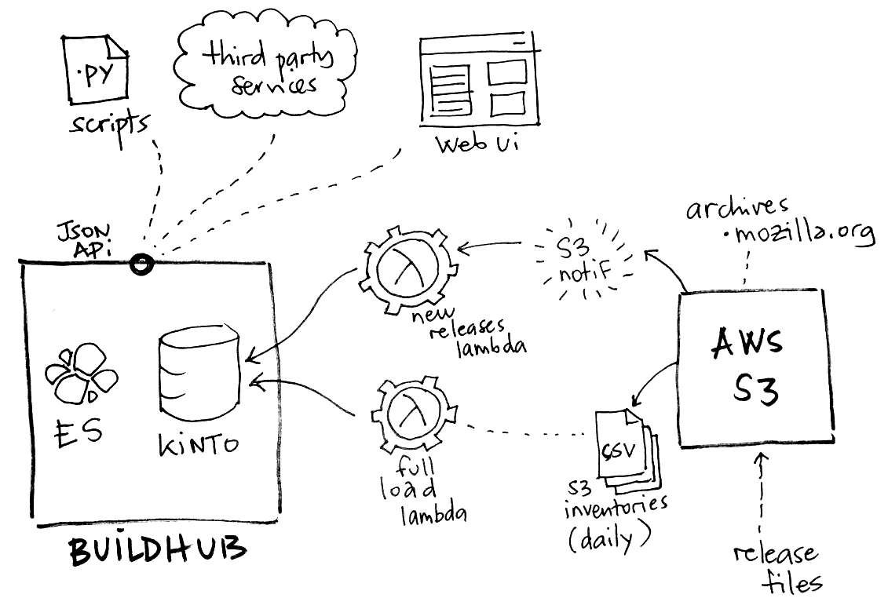

.. _jobs:

Jobs
####

A script will aggregate build information from Mozilla archives, and another is in charge of keeping it up to date.

.. note::

    The ``user:pass`` in the command-line examples is the Basic auth for Kinto.

Currently we use `Kinto <http://kinto-storage.org>`_ as a generic database service. It allows us to leverage its simple API for storing and querying records. It also comes with a set of client libraries for JavaScript, Python etc.

.. note::

    More specific solutions may replace it when the product scope evolves. Like for example fetching information from:

    * `Automatic Update Service (AUS, a.k.a Balrog) <https://wiki.mozilla.org/Balrog>`_

Initialization
==============

We provide an initialization manifest that will define the buckets and collection and their permissions.

Load it with:

.. code-block:: bash

    kinto-wizard load --server https://kinto/ --auth user:pass initialization.yaml

The JSON schema validation can be enabled on the server with the following setting:

.. code-block:: ini

    kinto.experimental_collection_schema_validation = true

Build for Amazon Lambda
=======================

In order to build the AWS Lambda Zip archive in an isolated environment, we use Docker:

* ``make get_zip``

Load latest S3 inventory
========================

A command to download the latest S3 manifests from Mozilla archives, and create records on a remote Kinto server.

.. code-block:: bash

    latest-inventory-to-kinto

Its configuration is read from environment variables:

* ``SERVER_URL`` (default: ``http://localhost:8888/v1``)
* ``BUCKET`` (default: ``build-hub``)
* ``COLLECTION`` (default: ``releases``)
* ``AUTH`` (default: ``user:pass``)
* ``NB_RETRY_REQUEST`` (default: ``3``)
* ``TIMEOUT_SECONDS`` (default: ``300``)

To use this script as an Amazon Lambda function, use the entry point:

* ``buildhub.lambda_s3_inventory:lambda_handler``

S3 Event lambda
===============

The Amazon Lambda function that is in charge of keeping the database up-to-date.

When releases are published on S3, a `S3 Event <http://docs.aws.amazon.com/AmazonS3/latest/dev/NotificationHowTo.html>`_ is triggered and `the lambda is invoked <http://docs.aws.amazon.com/lambda/latest/dg/with-s3.html>`_.

.. note::

    Since release records contain information from JSON metadata files, we handle the case when the JSON metdata file is published before the actual archive, and vice-versa.

The lambda accepts the following configuration (from environment variables):

* ``SERVER_URL`` (default: ``http://localhost:8888/v1``)
* ``BUCKET`` (default: ``build-hub``)
* ``COLLECTION`` (default: ``releases``)
* ``AUTH`` (default: ``user:pass``)
* ``NB_RETRY_REQUEST`` (default: ``3``)
* ``TIMEOUT_SECONDS`` (default: ``300``)

Load S3 inventory manually
==========================

In order to fetch inventories from S3, install the dedicated Amazon Services client:

.. code-block:: bash

   sudo apt-get install awscli

We are interested in two listing: ``firefox`` and ``archive`` (thunderbird, mobile).

.. code-block:: bash

    export LISTING=archive

List available manifests in the inventories folder:

.. code-block:: bash

    aws --no-sign-request --region us-east-1 s3 ls "s3://net-mozaws-prod-delivery-inventory-us-east-1/public/inventories/net-mozaws-prod-delivery-$LISTING/delivery-$LISTING/"

Download the latest manifest:

.. code-block:: bash

    aws --no-sign-request --region us-east-1 s3 cp s3://net-mozaws-prod-delivery-inventory-us-east-1/public/inventories/net-mozaws-prod-delivery-$LISTING/delivery-$LISTING/2017-08-02T00-11Z/manifest.json

Download the associated files (using `jq <https://stedolan.github.io/jq/download/>`_):

.. code-block:: bash

    files=$(jq -r '.files[] | .key' < 2017-08-01T00-12Z/manifest.json)
    for file in $files; do
        aws --no-sign-request --region us-east-1 s3 cp "s3://net-mozaws-prod-delivery-inventory-us-east-1/public/$file" .
    done

Parse S3 inventory, fetch metadata, and print records as JSON in stdout:

.. code-block:: bash

    zcat *.csv.gz | inventory-to-records > records.data

Load records into Kinto:

.. code-block:: bash

    cat records.data | to-kinto --server https://kinto/ --bucket build-hub --collection release --auth user:pass initialization.yaml

Repeat with ``LISTING=firefox``.

.. note::

    All three commands can be piped together with their respective parameters::

        zcat *.csv.gz | inventory-to-records | to-kinto
