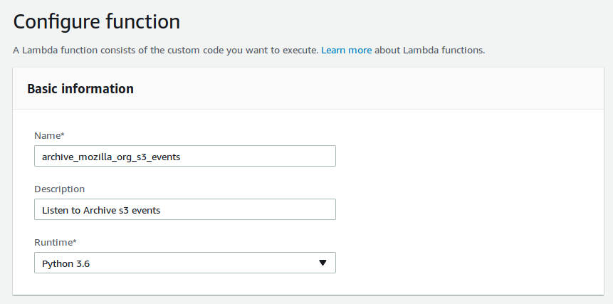
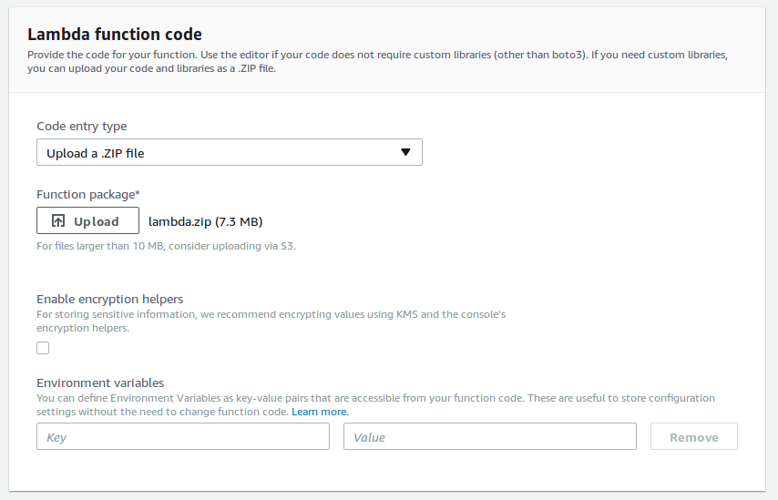
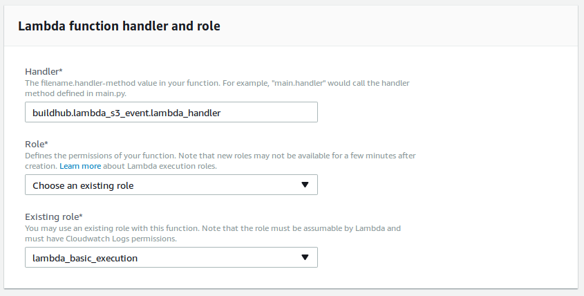
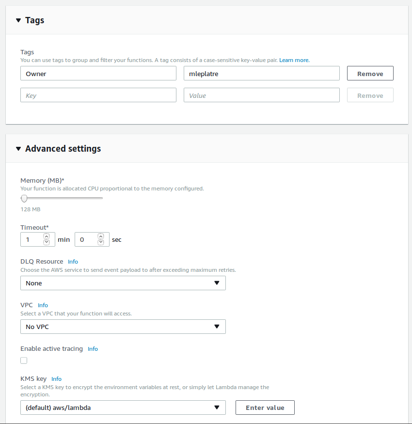

.. _jobs:

Jobs
####

A script will aggregate all build information from Mozilla archives, and another is in charge of keeping it up to date.

Everything can be executed from a command-line, but we use `Amazon Lambda <https://aws.amazon.com/lambda/>`_ in production.

.. image:: overview.png

Currently we use `Kinto <http://kinto-storage.org>`_ as a generic database service. It allows us to leverage its simple API for storing and querying records. It also comes with a set of client libraries for JavaScript, Python etc.

Initialization
==============

.. note::

    The ``user:pass`` in the command-line examples is the Basic auth for Kinto.

The following is not mandatory but recommended. Kinto can use the JSON schema to validate the records. The following setting should be set to ``true`` in the server configuration file:

.. code-block:: ini

    kinto.experimental_collection_schema_validation = true

Load latest S3 inventory
========================

A command to initialize the remote Kinto server, download the latest S3 manifests, containing information about all available files on archive.mozilla.org, and send that information as buildhub records to the remote Kinto server.

.. code-block:: bash

    latest-inventory-to-kinto

The command will go through the list of files, pick release files, and deduce their metadata. It is meant to be executed on an empty server, or periodically to catch up with recent releases in case the other event-based lambda had failed.

Its configuration is read from environment variables:

* ``SERVER_URL`` (default: ``http://localhost:8888/v1``)
* ``BUCKET`` (default: ``build-hub``)
* ``COLLECTION`` (default: ``releases``)
* ``AUTH`` (default: ``user:pass``)
* ``CACHE_FOLDER`` (default: ``.``)
* ``NB_RETRY_REQUEST`` (default: ``3``)
* ``BATCH_MAX_REQUESTS`` (default: taken from server)
* ``TIMEOUT_SECONDS`` (default: ``300``)
* ``INITIALIZE_SERVER`` (default: ``true``): whether to initialize the destination bucket/collection.
* ``SENTRY_DSN`` (default: empty/disabled. Example: ``https://<key>:<secret>@sentry.io/buildhub``)
* ``MIN_AGE_LAST_MODIFIED_HOURS`` (default: ``0`` which disables it): number of days of age to consider analyzing and comparing against database.

To use this script as an Amazon Lambda function, use the entry point:

* ``buildhub.lambda_s3_inventory.lambda_handler``

S3 Event lambda
===============

The Amazon Lambda function that is in charge of keeping the database up-to-date. This one cannot be executed from the command-line.

When releases are published on S3, an `S3 Event <http://docs.aws.amazon.com/AmazonS3/latest/dev/NotificationHowTo.html>`_ is triggered and `the lambda is invoked <http://docs.aws.amazon.com/lambda/latest/dg/with-s3.html>`_.

Use the following entry point:

* ``buildhub.lambda_s3_event.lambda_handler``

.. note::

    Since release records contain information from JSON metadata files, we handle the case when the JSON metdata file is published before the actual archive, and vice-versa.

The lambda accepts the following configuration (from environment variables):

* ``SERVER_URL`` (default: ``http://localhost:8888/v1``)
* ``BUCKET`` (default: ``build-hub``)
* ``COLLECTION`` (default: ``releases``)
* ``CACHE_FOLDER`` (default: ``.``)
* ``AUTH`` (default: ``user:pass``)
* ``NB_RETRY_REQUEST`` (default: ``3``)
* ``TIMEOUT_SECONDS`` (default: ``300``)
* ``SENTRY_DSN`` (default: empty/disabled. Example: ``https://<key>:<secret>@sentry.io/buildhub``)

Setup and configure Amazon Lambda
=================================

In order to build the AWS Lambda Zip archive in an isolated environment, we use Docker:

* ``make lambda.zip``

(...or most likely ``sudo make lambda.zip``)

This will produce a zip file that has to be uploaded in AWS Lambda configuration panel.

Using Docker
============

Some commands are exposed in the container entry-point command (``docker run``).

The exhaustive list of available commands and description is available using:

::

    docker run -t mozilla/buildhub

For example, run tests:

::

    docker run -t mozilla/buildhub test

Or load the latest S3 inventory:

::

    docker run -e "SERVER_URL=https://buildhub.prod.mozaws.net/v1" -e "AUTH=user:pass" -t mozilla/buildhub latest-inventory-to-kinto

Load S3 inventory manually
==========================

In order to fetch inventories from S3, install the dedicated Amazon Services client:

.. code-block:: bash

   sudo apt-get install awscli

We are interested in two listing: ``firefox`` and ``archive`` (thunderbird, mobile).

.. code-block:: bash

    export LISTING=archive

List available manifests in the inventories folder:

.. code-block:: bash

    aws --no-sign-request --region us-east-1 s3 ls "s3://net-mozaws-prod-delivery-inventory-us-east-1/public/inventories/net-mozaws-prod-delivery-$LISTING/delivery-$LISTING/"

Download the latest manifest:

.. code-block:: bash

    aws --no-sign-request --region us-east-1 s3 cp s3://net-mozaws-prod-delivery-inventory-us-east-1/public/inventories/net-mozaws-prod-delivery-$LISTING/delivery-$LISTING/2017-08-02T00-11Z/manifest.json

Download the associated files (using `jq <https://stedolan.github.io/jq/download/>`_):

.. code-block:: bash

    files=$(jq -r '.files[] | .key' < 2017-08-01T00-12Z/manifest.json)
    for file in $files; do
        aws --no-sign-request --region us-east-1 s3 cp "s3://net-mozaws-prod-delivery-inventory-us-east-1/public/$file" .
    done

Initialize the remote server from a manifest that will define the buckets, collection, records schema, and related permissions. This command is idempotent, and will only modify existing objects if something was changed.

.. code-block:: bash

    kinto-wizard load --server https://kinto/ --auth user:pass jobs/buildhub/initialization.yml

Parse S3 inventory, fetch metadata, and print records as JSON in stdout:

.. code-block:: bash

    zcat *.csv.gz | inventory-to-records > records.data

Load records into Kinto:

.. code-block:: bash

    cat records.data | to-kinto --server https://kinto/ --bucket build-hub --collection release --auth user:pass

Repeat with ``LISTING=firefox``.

.. note::

    All three commands can be piped together with their respective parameters::

        zcat *.csv.gz | inventory-to-records | to-kinto
